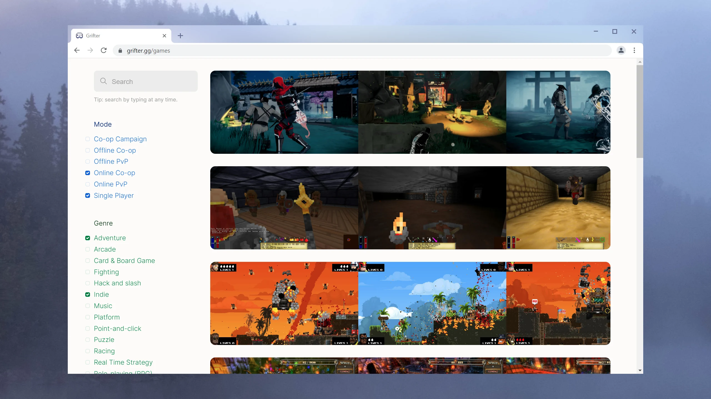

# Grifter

**Grifter is your self-hosted video game library.** Browse your games and install them on any computer.

[**Set up Grifter in less than 10 minutes!**](https://www.youtube.com/watch?v=THkeMO4j5T0)

[](https://www.youtube.com/watch?v=THkeMO4j5T0)

## What's good

- Fast.
- Designed with a focus on _discovery_. You have a lot of unplayed games...don't you? Grifter can help you find the hidden gems amongst your collection.
- Rich cataloging enabled by [IGDB](https://igdb.com): tags, screenshots, videos, descriptions.
- Offline-friendly; everything's cached.
- Single binary.

## Installing

Download one of the prebuilt binaries here:

- Windows TODO
- Linux TODO
- Raspberry PI TODO

## FAQ

> Does this work with steam games?

No. You don't own the games you bought on Steam and you're not allowed to copy them to other computers. I recommend buying DRM-free games from [GOG](https://gog.com) or [Itch.io](https://itch.io).

## Building

Prerequisites:

- Rust (nightly)
- [Perl](https://strawberryperl.com/)
- Node

```bash
npm install --global elm uglify-js
cargo build
```

## Credits

Favicon by [VectorPixelStar](https://twitter.com/vectorpixelstar)
